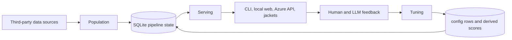
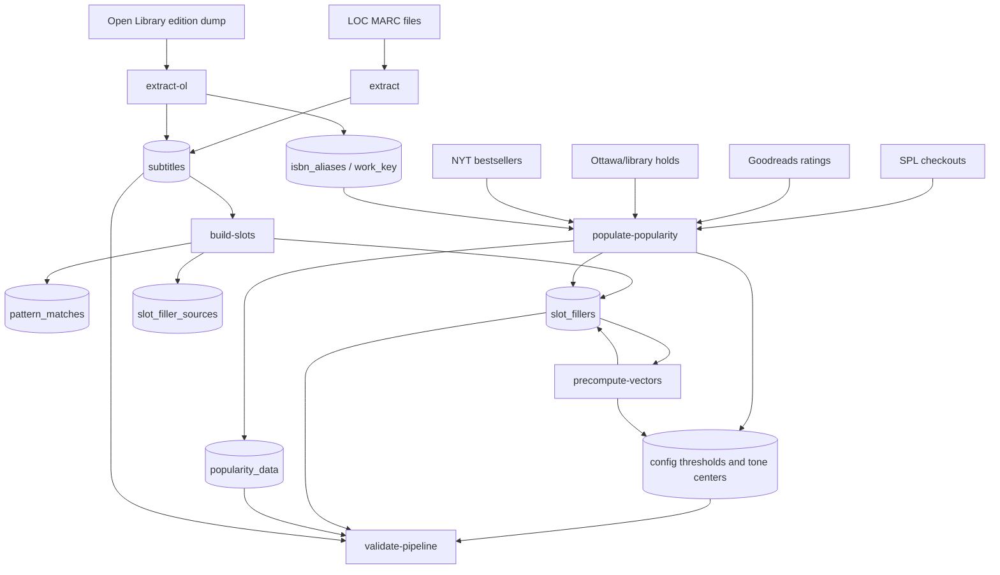
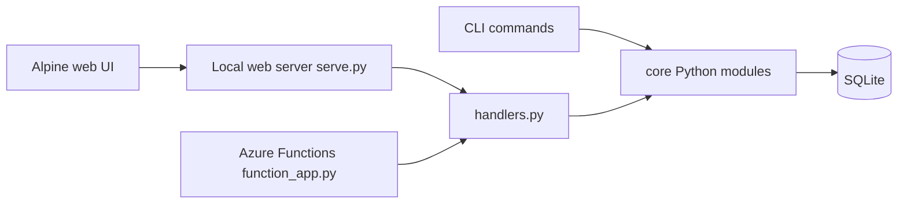
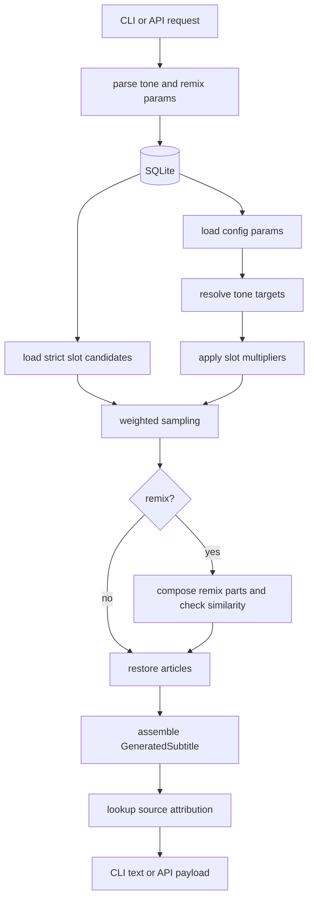
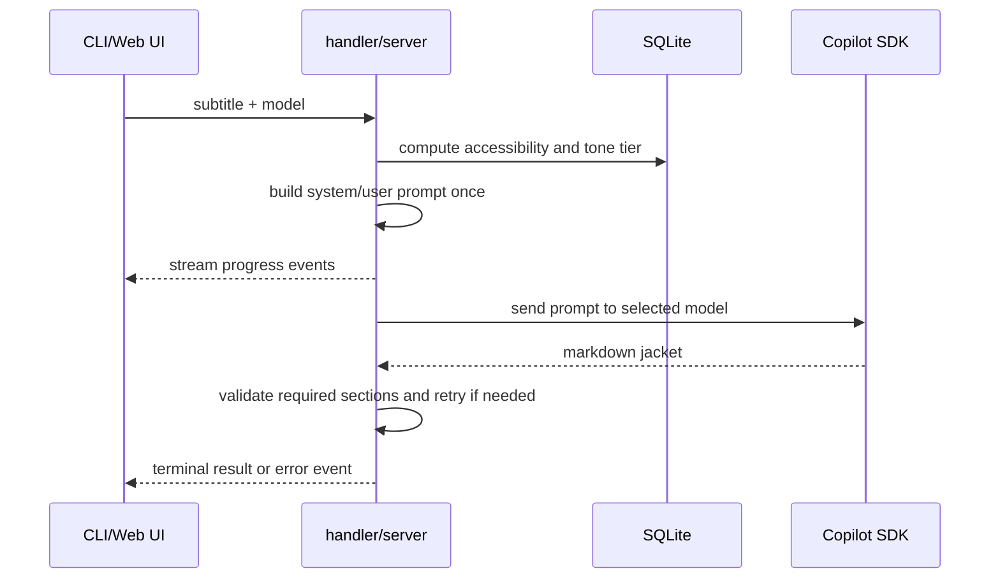
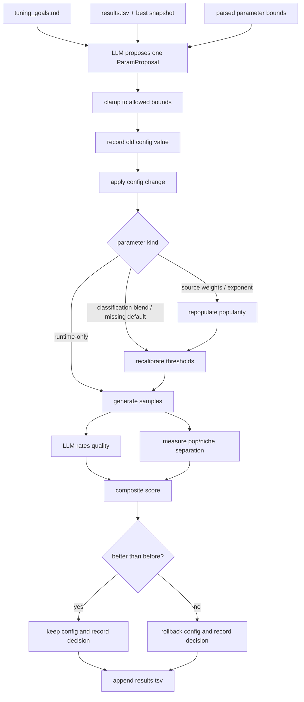
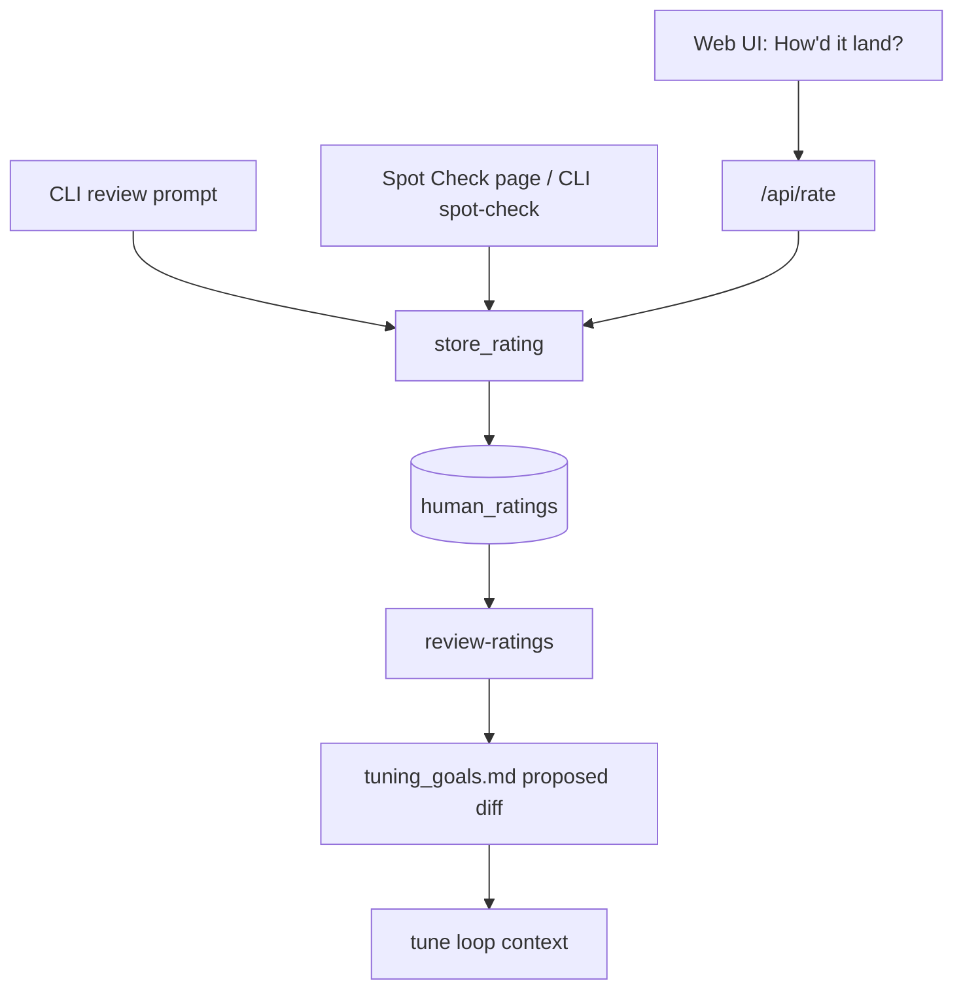

# End-to-end pipeline and tuning guide

This document explains how subtitle-generator works from raw third-party data
through population, tuning, and serving. It is the readable companion to the
contract modules and `subtitle-gen validate-pipeline`, not a replacement for
those checks.

## TL;DR

subtitle-generator mines real catalog subtitles, extracts pieces that fit the
pattern `X, Y, and the Z of W`, assigns each piece frequency/popularity/tone
state, optionally precomputes remix vectors, and serves a generator that draws
weighted slot fillers from SQLite.

The important rule is: **population creates the raw and derived universe,
serving reads that universe to assemble subtitles and jackets, and tuning only
changes the numeric state that influences scoring and generation.**

Tuning does not train a model. It changes numeric config rows in SQLite,
generates samples, asks an LLM to rate quality, measures tone separation, keeps
or reverts the proposed config change, and records the result.

## Architecture at a glance

There are three main concerns:

1. **Population** builds and enriches SQLite state from external data.
2. **Serving** reads validated SQLite state to generate subtitles, jackets, and
   API responses.
3. **Tuning** evaluates output quality and feeds accepted numeric changes back
   into `config` and derived scoring state.



The highest-level data handoff is:

```text
raw records -> subtitles -> slot fillers -> scored fillers -> generated output
```

The most important join/key transition is:

```text
ISBN -> Open Library work_key -> source work popularity -> slot filler score
```

Runtime generation is filler-centric. Popularity scoring is work-centric.
Source extraction is ISBN/title/subtitle-centric.

## Population: build-time data and derived state

Population is everything that creates or enriches the SQLite database before
normal runtime generation. It owns raw ingestion, slot extraction, popularity
scoring, threshold calibration, and remix precompute.



Normal build order:

```bash
uv run subtitle-gen download --parts all
uv run subtitle-gen extract
uv run subtitle-gen download-ol
uv run subtitle-gen extract-ol
uv run subtitle-gen build-slots
uv run subtitle-gen download-popularity
uv run subtitle-gen populate-popularity
uv run subtitle-gen precompute-vectors
uv run subtitle-gen validate-pipeline
```

`validate-pipeline` checks full serving readiness, including the remix
precompute contract. If you stop before `precompute-vectors`, non-remix
experiments may still work locally, but validation will report that the DB is
not ready for the full runtime path.

### Population inputs

The generator is grounded in real book/catalog data:

| Source | Used for | Shape in the pipeline |
|---|---|---|
| Library of Congress MARC bulk files | Primary raw subtitle corpus | Downloaded, parsed, and inserted into `subtitles`. |
| Open Library edition dump | Additional subtitles and ISBN/work identity | Extracted into `subtitles`; provides `work_key` and edition-count prior. |
| Seattle Public Library checkout data | Demand signal | ISBN-keyed checkouts mapped to Open Library works. |
| Goodreads/UCSD Book Graph | Demand/engagement signal | ISBN-keyed ratings counts mapped to works. |
| Ottawa/Canadian library data | Library holds/appearances signal | ISBN-keyed library demand mapped to works. |
| NYT bestseller data | Bestseller signal | ISBN-keyed bestseller appearances mapped to works. |

Human ratings are not population inputs. They are feedback used by tuning and
analysis.

### Subtitle extraction

Extraction turns LOC/Open Library records into normalized `subtitles` rows.
It also applies source-level cleanup for repeated title/subtitle corruption
before rows enter the corpus.

Important fields include:

- `title`
- `subtitle`
- `lang`
- source metadata such as `lccn`, `source_file`, and `isbn`

This stage does not decide whether a subtitle is usable for generation, but it
does repair obvious metadata corruption when a real title/subtitle split can be
recovered. Common repairable shapes include `Title: Subtitle` with a duplicated
subtitle field, `Title: Subtitle Title: Subtitle`, and `Title: Subtitle
Subtitle`. Rows whose title/subtitle repetition cannot be repaired are skipped
or later rejected by the candidate-stage guard.

### Pattern matching and slot extraction

`build-slots` looks for subtitles matching:

```text
X, Y, and [the/a/an] Z of [the/a/an] W
```

The regex match is only the first gate. `slots.py` then repairs source
title/subtitle duplication when possible, requires exactly two or three original
list clauses, and uses spaCy plus orthographic filters to reject catalog noise,
weak/jargon fillers, truncation, encoding artifacts, all-caps MARC leakage,
implausible action nouns, and bad of-objects.

Accepted three-clause source subtitles enrich the `list_item` pool, but runtime
generation still emits two list slots. Four-or-more-clause records are rejected
instead of being trimmed into plausible-looking fragments. Likewise, if any
original list clause fails validation, the whole candidate is rejected; the
pipeline no longer silently drops the failed item and keeps the remaining list
items.

`of_object` validation includes a small guard against SEO/prepositional starts
such as `using`, `with`, `for`, `by`, `via`, and `through`. This guard sits on
top of the existing noun-phrase/POS checks so valid noun phrases with internal
prepositions can still pass.

Outputs:

| Table | Meaning |
|---|---|
| `pattern_matches` | Clean NLP-validated source subtitle decomposed into list items, action noun, of-object, and observed articles. |
| `slot_fillers` | Deduplicated filler inventory by slot type with frequency and later scoring/precompute columns. |
| `slot_filler_sources` | Many-to-many link from filler to source subtitle; used for attribution and popularity scoring. |

Slot types include:

- `list_item`
- `action_noun`
- `of_object`
- remix sub-parts: `of_modifier`, `of_head`, `of_topic`, `of_complement`

The generator samples only `mode = 'strict'` fillers.

### Source-title market labels

`pattern_matches` also owns optional source-title market-tier labels:

- `llm_market_tier`
- `llm_market_tier_confidence`
- `llm_market_tier_rationale`

These labels sort real source titles into the shared `pop` / `mainstream` /
`niche` taxonomy used by jacket generation. The definitions live in
`market_tiers.py`, with separate source-label and jacket-tone wording for each
tier.

Use the infrastructure command to preview or label a reproducible batch:

```bash
uv run subtitle-gen classify-source-tiers --dry-run --limit 20
uv run subtitle-gen classify-source-tiers --limit 200 --batch-size 10 --selection random --random-seed 20260501
```

By default the command uses hosted Responses `web_search` for each source title.
The rationale should include the evidence strength: exact match, weak/adjacent
match, or no reliable match. Use `--no-web-search` for title/subtitle-only
structured labeling. The command persists labels on `pattern_matches` and exports them to
`api/data/source_tier_labels.csv` keyed by stable `subtitle_id` plus the current
`pattern_match_id`. `build-slots` preserves existing source-tier labels by
`subtitle_id` when a source title still validates after a rebuild. The label CSV
is a build/evaluation artifact, not part of the runtime mini DB; serving uses the
generated-output classifier.
Downstream joins should use `subtitle_id`; `pattern_match_id` reflects the
current `pattern_matches` row and is not stable when a source title stops
validating after a rebuild.

The lower-level Copilot MCP web-search bridge lives in
`subtitle_generator.copilot_web_search` as a plain importable module for future
scripts/tools. No FastMCP server is required for this workflow.

Because `pattern_matches` is now clean-only, rebuilding slots after a validation
change changes more than the slot table. Re-run popularity population,
calibration, remix vector precompute, and `validate-pipeline` so
`slot_filler_sources`, filler scores, tone thresholds, article statistics,
remix constants, exports, and serving all agree with the same filtered candidate
universe.

### Popularity scoring

Popularity scoring converts third-party demand/supply data into numeric work
and filler scores.

`data/populate_popularity.py` first maps source dictionaries into work-keyed
intermediate structures:

- `work_spl`
- `work_ol`
- `work_gr`
- `work_ottawa`
- `work_nyt`
- `all_works`

Each source is normalized onto a percentile scale using `log10(1 + raw_value)`.
Demand sources are combined as a weighted average over the signals present for
a work:

$$
\text{demand\_score} =
\frac{\sum(\text{source\_weight} \cdot \text{source\_percentile})}
     {\sum(\text{source\_weight})}
$$

Open Library edition count is treated as a prior/confidence signal rather than
as a peer demand source. The final work composite is:

$$
\text{composite} =
\text{confidence} \cdot \text{demand\_score}
+ (1 - \text{confidence}) \cdot \text{open\_library\_percentile}
$$

where confidence is based on the amount of demand-source weight actually
observed. Works with no demand sources are capped so Open Library alone cannot
make them look like high-demand pop titles. NYT appearances get a high floor
because even partial bestseller-list presence is meaningful.

The persisted result is one row per work in `popularity_data`.

Runtime generation samples fillers, not works, so work scores are pushed down
to `slot_fillers`. For fillers with source works, the Level 1 score is the mean
of the top three source-work composite scores. This avoids overvaluing a filler
because it appeared once in a very popular book. Fillers without work-level
backing use a frequency fallback:

$$
\text{fallback\_score} = \log_{10}(1 + \text{freq})
$$

The resulting filler columns are:

- `popularity_score`
- `popularity_level`
- `popularity_confidence`

### Calibration: the population-to-serving handoff

After popularity changes, calibration derives the numeric bands that serving
uses for tone targeting and jacket tone selection:

- `accessibility_threshold_pop`
- `accessibility_threshold_mainstream`
- `tier_center_pop`
- `tier_center_mainstream`
- `tier_center_niche`

These values are written to `config`. Tier centers are the source of truth for
runtime concepts such as "pop", "mainstream", and "niche"; serving derives
slot-specific tone targets from the relevant tier center and `pop_slot_mult_*`
runtime multipliers.

#### Popularity thresholds and Gaussian bias

The threshold cutoffs are not Gaussian. Calibration sorts strict fillers by a
classification score:

$$
\begin{aligned}
\text{classification\_score} &=
(1 - \text{pop\_classification\_blend}) \cdot \log_{10}(1 + \text{freq}) \\
&\quad + \text{pop\_classification\_blend} \cdot \text{popularity\_score}
\end{aligned}
$$

It then chooses percentile cutoffs from that observed distribution:

| Config key | Source |
|---|---|
| `accessibility_threshold_pop` | 92nd percentile: top roughly 8% of strict fillers. |
| `accessibility_threshold_mainstream` | 64th percentile: next roughly 28% are mainstream; below that is niche. |
| `tier_center_pop` | Median score within the pop band. |
| `tier_center_mainstream` | Median score within the mainstream band. |
| `tier_center_niche` | Median score within the niche band. |

The Gaussian part happens after those cutoffs exist. Serving uses the tier
centers as soft targets, not hard buckets, so nearby fillers get boosted and
distant fillers get suppressed:

$$
\begin{aligned}
\text{bias} &=
\exp\left(-\left(\frac{\text{filler\_score} - \text{tone\_target}}
{\text{weighted\_sample\_spread}}\right)^2\right) \\
\text{weight} &=
\text{base\_weight} \cdot
\left(\text{weighted\_sample\_bias\_floor}
+ (1 - \text{weighted\_sample\_bias\_floor}) \cdot \text{bias}\right)
\end{aligned}
$$

Tone filters are hard generation constraints. When a caller requests a tier,
generation retries with the tier-center-derived target until `compute_tier_evidence()`
classifies the generated subtitle as one of the requested tiers. Jacket tone
selection then uses the classifier result directly; it no longer samples or
forces a mismatched requested tier after generation.

### Remix precompute

Remixing can create a new of-object from source-derived sub-parts.

| Type | Original shape | Remixed shape |
|---|---|---|
| Type 1 | compound noun phrase | `modifier + head` |
| Type 2 | prepositional noun phrase | `topic + prep + complement` |

`precompute_remix_data()` classifies strict `of_object` fillers and stores:

- `remix_type`
- `remix_prep`
- `remix_word_count`
- `vector_sum`
- `token_count`
- `centroid_dot`
- `norm_sq`

It also stores config constants:

- `embedding_version`
- `centroid_norm`
- `avg_cross_sim_t1`
- `avg_cross_sim_t2`
- `embedding_centroid` for the development fallback path

#### Remix coherence: centroids and cross terms

The centroid fields are the remix coherence shortcut. During precompute, the
pipeline embeds every strict source-derived `of_object` and averages those
embeddings into a centroid: the semantic center of real source phrases. A
candidate remix is considered more plausible when its combined embedding points
in roughly the same direction as that centroid.

The runtime path does not store or load full vectors for every request. Instead,
it stores enough scalar data to approximate cosine similarity:

$$
\text{similarity} \approx
\frac{\text{dot}(\text{remix\_parts}, \text{centroid})}
     {\text{norm}(\text{remix\_parts}) \cdot \text{norm}(\text{centroid})}
$$

The pieces map as follows:

| Field | What it means |
|---|---|
| `vector_sum` | Sum of token embeddings for one filler or remix sub-part. |
| `token_count` | Number of embedded tokens used to build `vector_sum`. |
| `centroid_dot` | Dot product between that filler's `vector_sum` and the source-phrase centroid. |
| `norm_sq` | Squared length of that filler's `vector_sum`. |
| `centroid_norm` | Length of the source-phrase centroid. |
| `avg_cross_sim_t1` | Average modifier/head similarity, used for Type 1 remixes. |
| `avg_cross_sim_t2` | Average topic/complement similarity, used for Type 2 remixes. |

The "cross" values are cross-term corrections, not diagram crossings. When two
parts are combined, the length of the combined vector depends on each part's
own length plus how much the parts point in similar directions. The runtime
approximates that combined length as:

$$
\sum_i \text{norm\_sq}_i
+ \sum_{i<j}
  2 \cdot \sqrt{\text{norm\_sq}_i}
    \cdot \sqrt{\text{norm\_sq}_j}
    \cdot \text{avg\_cross\_sim}
$$

That is enough for `_approx_cosine_sim()` to reject low-coherence remixes
without loading spaCy, NumPy, or full embedding vectors during serving.

At runtime, the preferred path uses this scalar decomposition. That lets the
web app and deployed handler evaluate remix coherence without doing large NLP
or vector work inside the request path.

## Serving: runtime generation, jackets, and APIs

Serving reads populated SQLite state. It should not parse third-party source
files, recalculate popularity from raw sources, or run tuning decisions.



`handlers.py` is the transport-neutral API boundary. It owns request parsing
and response shapes for:

- `handle_generate`
- `handle_jacket`
- `handle_rate`
- `handle_health`

Local serving (`serve.py`) wraps those handlers with stdlib HTTP and adds local
SSE streaming for full jacket generation. Azure Functions wrap the same shared
handler semantics. The deployed jacket path is prompt-only because the hosted
mini database/runtime does not carry the full local generation environment.

The web UI is intentionally thin. It calls the API, renders color-coded slots,
streams jacket progress, and stores feedback through `/api/rate`; generation
decisions remain server-side.

### Subtitle generation



`generate_subtitle()` is the stable runtime facade. Internally it:

1. Creates a seeded RNG when a seed is supplied.
2. Loads strict candidates for list items, action nouns, and of-objects.
3. Adjusts requested tone targets with per-slot multipliers.
4. Samples two list items, one action noun, and one of-object.
5. Optionally attempts of-object remixing.
6. Restores action/of-object articles from corpus statistics and heuristics.
7. Title-cases and returns a `GeneratedSubtitle`.

### Sampling weights

Base sampling weight blends frequency and popularity:

$$
\begin{aligned}
\text{base\_weight} &=
(1 - \text{pop\_base\_weight\_blend}) \cdot \sqrt{\text{freq}} \\
&\quad + \text{pop\_base\_weight\_blend} \cdot \sqrt{\text{popularity\_score}}
\end{aligned}
$$

When a tone target is present, the base weight is multiplied by a Gaussian-like
bias around the target:

$$
\begin{aligned}
\text{filler\_score} &=
(1 - \text{pop\_classification\_blend}) \cdot \log_{10}(1 + \text{freq}) \\
&\quad + \text{pop\_classification\_blend} \cdot \text{popularity\_score} \\
\text{bias} &=
\exp\left(-\left(\frac{\text{filler\_score} - \text{tone\_target}}
{\text{weighted\_sample\_spread}}\right)^2\right) \\
\text{weight} &\leftarrow
\text{weight} \cdot
\left(\text{weighted\_sample\_bias\_floor}
+ (1 - \text{weighted\_sample\_bias\_floor}) \cdot \text{bias}\right)
\end{aligned}
$$

"Pop" and "niche" do not select from separate hard-coded lists. They use the
same candidate pools with different numeric targets.

### Jacket generation

Jacket generation is downstream of subtitle generation. It does not change the
subtitle pipeline state.



The prompt tone is chosen from the subtitle's accessibility score unless the
caller supplies an override. The generated jacket is expected to contain:

- `## Title`
- `## Subtitle`
- `## Internal Concept`
- `## Back Cover`
- `## Review 1`
- `## Review 2`

Public output strips `## Internal Concept` by default. For the local web server,
`serve.py` precomputes the DB-backed prompt and passes that exact prompt to
generation, so the prompt shown in the UI matches the generated jacket. The
frontend treats SSE `result` and `error` events as terminal so the UI does not
wait for EOF after completion.

## Tuning: feedback-driven config changes

Tuning is an autoresearch-style hill-climbing loop: it makes one bounded config
change, measures whether output improved, then keeps or reverts that change.

It manipulates:

- numeric config rows in `config`
- derived popularity scores in `slot_fillers` when population-related params
  change
- derived thresholds and tier centers when classification-related params change
- result logs and best-state snapshots

It does not manipulate:

- source records in `subtitles`
- extracted pattern matches
- the generation algorithm itself
- any trained model weights

### Tuning loop



Calibration always follows repopulation because changing source weights or
exponents changes the score distribution used to derive tier thresholds and
tone centers.

### Proposal inputs

The proposer sees:

- `tuning_goals.md`
- parameter bounds parsed from the goals table
- recent experiment history
- regime-change markers when the available parameter set changes
- current parameter values

The proposal schema is strict:

```text
ParamProposal:
  param: str
  new_value: float
  reasoning: str
```

Only one parameter is changed at a time. Bounds are enforced before evaluation.

### Evaluation metrics

The evaluation harness uses two primary scores.

Quality:

1. Generate a sample set.
2. Ask the rating model to score each subtitle for coherence, evocativeness,
   and surprise on a 1-10 scale.
3. Normalize the result to 0-1.

Tone separation:

1. Generate pop-targeted and niche-targeted sample sets with fixed seeds.
2. Convert each filler to its blended classification score.
3. Build histograms over the observed score range.
4. Return `1 - histogram_overlap`.

Composite:

$$
\text{composite} =
\text{quality\_weight} \cdot \text{quality}
+ (1 - \text{quality\_weight}) \cdot \text{separation}
$$

### Keep/revert semantics

The tuning code represents a proposed mutation as a `ConfigChange`:

```text
param
old_value
new_value
```

If the new composite score wins, the config row stays. If it loses, the change
is reverted through the same config-writing path and the config cache is
invalidated. `ProposalDecision` records before/after quality, separation, and
composite scores.

This is why `config` is the tuning boundary: a proposal can be applied, measured,
kept, or rolled back without rewriting source data.

### Human feedback paths



Human feedback is stored as durable data, not immediately applied as a config
change. It can include:

- thumbs up/down
- system tone
- human tone override
- tags such as `interesting`, `realistic`, `funny`, `boring`, `broken`, and
  `nonsense`
- free text
- config snapshot
- source (`web_user`, `spot_check`, etc.)

`review-ratings` summarizes mismatch patterns and asks the proposer model for
targeted edits to `tuning_goals.md`. Those edits are displayed for human review;
they are not applied silently.

### Parameter dependency map

| Parameter family | Affects | Needs repopulate? | Needs recalibration? |
|---|---|---:|---:|
| `pop_weight_spl`, `pop_weight_ol`, `pop_weight_gr`, `pop_weight_nyt`, `pop_weight_library` | Work-level `composite_score` and filler `popularity_score` | Yes | Yes |
| `pop_exponent` | Source score contrast before work-level scoring | Yes | Yes |
| `pop_classification_blend` | Tier classification and tone-bias alignment | No | Yes |
| `pop_missing_default` | Missing-popularity filler classification | No | Yes |
| `pop_base_weight_blend` | Runtime base sampling weights | No | No |
| `weighted_sample_spread`, `weighted_sample_bias_floor` | Runtime tone-bias strength | No | No |
| `pop_slot_mult_*` | Per-slot runtime target multipliers | No | No |
| `article_*` | Runtime article restoration | No | No |
| `remix_reject_double_of` | Runtime remix filtering | No | No |

This distinction matters because source-weight changes are expensive and rewrite
derived data, while runtime-only changes can be evaluated by generating new
samples from the existing database.

## Validation and readiness

`subtitle-gen validate-pipeline` is read-only. It checks that the database and
Python contracts are ready for generation/tuning/serving.

Validation includes:

- required tables and columns by stage
- numeric config values for known tunable params
- known model IDs
- remix precompute config and columns
- strict filler popularity coverage
- runtime candidate availability
- shared handler functions

Use it before tuning, serving, exporting, or investigating strange runtime
behavior.

## Debugging mental model

When behavior looks wrong, identify which concern owns the symptom:

| Symptom | First layer to inspect |
|---|---|
| Bad source/citation or missing attribution | `slot_filler_sources`, `find_source`, mini DB export. |
| Weird catalog/jargon filler | `slots.py` validation filters and `slot_fillers.mode`. |
| Pop mode feels too obscure | popularity scores, thresholds, `pop_classification_blend`, tier centers and slot multipliers. |
| Pop and niche feel similar | `measure_tone_separation`, tier centers, slot multipliers, sampling spread/bias floor. |
| Tuning keeps rejecting good-looking changes | metric scale, threshold calibration, results history/regime markers. |
| Remix output is ungrammatical | remix classification, article stats, similarity threshold, double-of rejection. |
| Web and CLI generate different shapes | `handlers.py` response contract vs CLI formatting. |
| Jacket prompt does not match output | `build_jacket_prompt`, `generate_jacket_from_prompt`, SSE result payload. |

## Reference: main artifacts

| Artifact | Role |
|---|---|
| `data\db\subtitles.db` | Full local SQLite database built from source data. |
| `subtitles` | Extracted source subtitle records plus title/source metadata. |
| `pattern_matches` | Clean validated subtitles decomposed into list/action/of-object fields. |
| `slot_fillers` | Canonical runtime filler inventory, including frequency, popularity, remix, vector, and scalar state. |
| `slot_filler_sources` | Links fillers back to source subtitles/books for attribution and popularity scoring. |
| `popularity_data` | Work-level demand/supply signals and `composite_score`. |
| `source_tier_labels.csv` | Exported source-title market labels from `pattern_matches.llm_market_tier*`; evaluation/calibration input, not runtime data. |
| `config` | Tuned numeric parameters and precompute constants. Defaults live in `config.py`. |
| `human_ratings` | Human feedback, tone overrides, tags, and config snapshots. |
| `schema_contracts.py` | Required table/column contracts by pipeline stage. |
| `parameter_state.py` | Typed views over model IDs and parameter families. |
| `remix_state.py` | Remix precompute readiness and runtime context contracts. |
| `pipeline_validation.py` | Read-only readiness checks composed into `subtitle-gen validate-pipeline`. |

## Reference: parameter and model state

The project has several different kinds of "model" and "weight" state. They
should not be conflated.

| Family | Stored in | Used by |
|---|---|---|
| LLM model IDs | Python constants in `parameter_state.py` | rating, proposal, jacket generation |
| Tunable numeric params | Defaults in `config.py`, DB overrides in `config` | scoring, generation, tuning |
| Popularity source weights | `pop_weight_*` config params | `populate-popularity` and repopulate during tuning |
| Popularity blending params | `pop_base_weight_blend`, `pop_classification_blend`, `pop_missing_default` | sampling, tone bias, tier classification |
| Tone thresholds and centers | auto-calibrated `config` rows | generation and jacket tone selection |
| Article params | `article_*` config rows and article stats blobs | article restoration |
| Remix params/constants | `remix_*`, `embedding_version`, centroid/cross-sim config rows | remix composition and validation |

`parameter_state.py` exposes typed views so each stage can ask for only the
state it needs: sampling params, popularity params, blend params, article params,
remix params, tier thresholds, derived tone targets, runtime generation params, and the
model registry.
